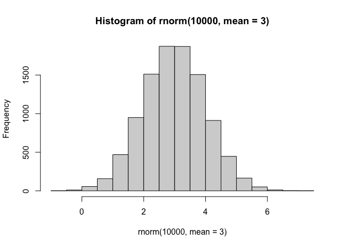
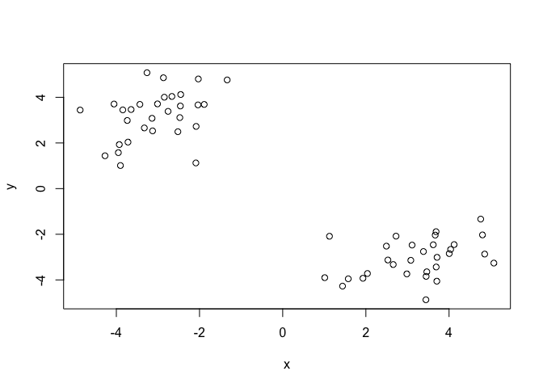
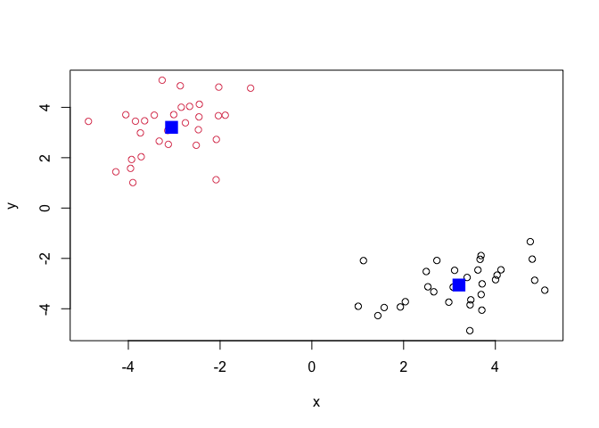
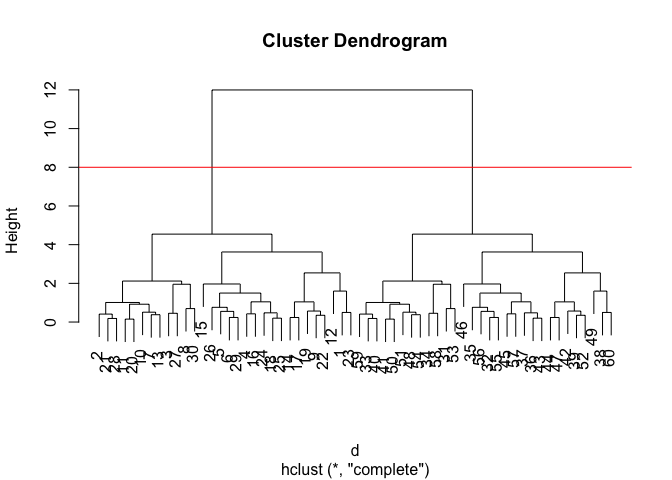
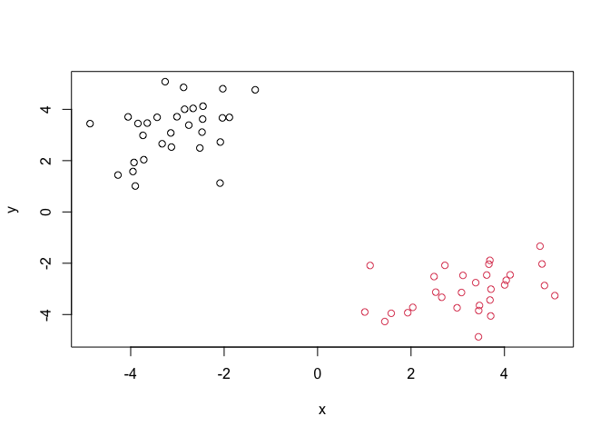
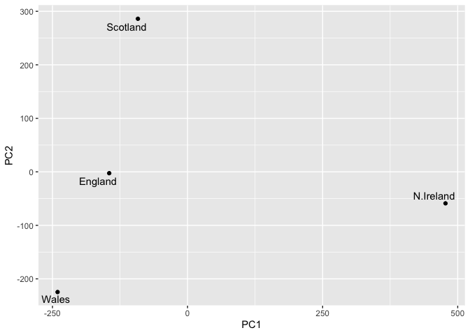
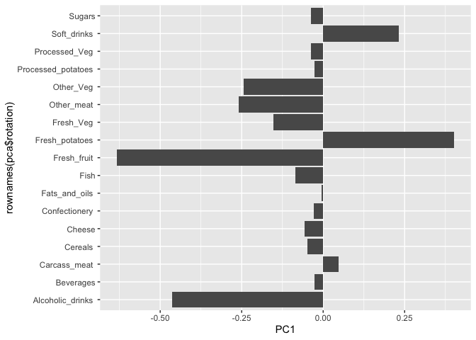

# Class 7: Machine Learning 1
Michael McClellan (PID: A169692395)
2025-10-25

- [Clustering](#clustering)
  - [K-means](#k-means)
  - [Hierarchical Clustering](#hierarchical-clustering)
- [Principal Component Analysis
  (PCA)](#principal-component-analysis-pca)
  - [Data import](#data-import)
  - [PCA to the rescue](#pca-to-the-rescue)

Today we will explore unsupervised machine learning methods starting
with clustering and dimensionality reduction.

## Clustering

To start let’s make up some data to cluster where we know what the
answer should be. The`rnorm()` function will help us here.

``` r
hist( rnorm(10000, mean=3) )
```



Return 30 numbers centered on -3

``` r
tmp <- c (rnorm(30, mean=-3),
        rnorm(30, mean=3) )

x <- cbind(x=tmp, y=rev(tmp))

x
```

                  x         y
     [1,] -2.520370  2.493413
     [2,] -2.452475  4.122285
     [3,] -2.867937  4.856854
     [4,] -3.434337  3.690729
     [5,] -3.141471  3.080186
     [6,] -3.326935  2.657802
     [7,] -2.460497  3.619965
     [8,] -1.334978  4.761235
     [9,] -3.951739  1.576634
    [10,] -2.473216  3.111237
    [11,] -2.036966  3.667013
    [12,] -2.087606  1.124631
    [13,] -2.756517  3.384257
    [14,] -3.928851  1.929261
    [15,] -4.870074  3.443294
    [16,] -3.010670  3.711692
    [17,] -3.719851  2.037345
    [18,] -3.844730  3.448759
    [19,] -3.901636  1.010804
    [20,] -1.886996  3.687906
    [21,] -2.846428  4.004251
    [22,] -4.272540  1.438824
    [23,] -2.081765  2.724943
    [24,] -4.055506  3.705915
    [25,] -3.645333  3.465005
    [26,] -3.737201  2.985496
    [27,] -3.262756  5.077592
    [28,] -2.664342  4.037549
    [29,] -3.128283  2.529384
    [30,] -2.028672  4.803948
    [31,]  4.803948 -2.028672
    [32,]  2.529384 -3.128283
    [33,]  4.037549 -2.664342
    [34,]  5.077592 -3.262756
    [35,]  2.985496 -3.737201
    [36,]  3.465005 -3.645333
    [37,]  3.705915 -4.055506
    [38,]  2.724943 -2.081765
    [39,]  1.438824 -4.272540
    [40,]  4.004251 -2.846428
    [41,]  3.687906 -1.886996
    [42,]  1.010804 -3.901636
    [43,]  3.448759 -3.844730
    [44,]  2.037345 -3.719851
    [45,]  3.711692 -3.010670
    [46,]  3.443294 -4.870074
    [47,]  1.929261 -3.928851
    [48,]  3.384257 -2.756517
    [49,]  1.124631 -2.087606
    [50,]  3.667013 -2.036966
    [51,]  3.111237 -2.473216
    [52,]  1.576634 -3.951739
    [53,]  4.761235 -1.334978
    [54,]  3.619965 -2.460497
    [55,]  2.657802 -3.326935
    [56,]  3.080186 -3.141471
    [57,]  3.690729 -3.434337
    [58,]  4.856854 -2.867937
    [59,]  4.122285 -2.452475
    [60,]  2.493413 -2.520370

Make a plot of `x`

``` r
plot(x)
```



### K-means

The main function in “base” R for K-means clustering is called
`kmeans()`:

``` r
km <- kmeans(x, centers=2)
km
```

    K-means clustering with 2 clusters of sizes 30, 30

    Cluster means:
              x         y
    1  3.206274 -3.057689
    2 -3.057689  3.206274

    Clustering vector:
     [1] 2 2 2 2 2 2 2 2 2 2 2 2 2 2 2 2 2 2 2 2 2 2 2 2 2 2 2 2 2 2 1 1 1 1 1 1 1 1
    [39] 1 1 1 1 1 1 1 1 1 1 1 1 1 1 1 1 1 1 1 1 1 1

    Within cluster sum of squares by cluster:
    [1] 54.60907 54.60907
     (between_SS / total_SS =  91.5 %)

    Available components:

    [1] "cluster"      "centers"      "totss"        "withinss"     "tot.withinss"
    [6] "betweenss"    "size"         "iter"         "ifault"      

The `kmeans()` function returns a “list” with 9 components. You can see
the named components of any list with the `attributes()` function.

``` r
attributes(km)
```

    $names
    [1] "cluster"      "centers"      "totss"        "withinss"     "tot.withinss"
    [6] "betweenss"    "size"         "iter"         "ifault"      

    $class
    [1] "kmeans"

> Q. How many points are in each cluster?

``` r
km$size
```

    [1] 30 30

> Q. Cluster assignment/membership vector?

``` r
km$cluster
```

     [1] 2 2 2 2 2 2 2 2 2 2 2 2 2 2 2 2 2 2 2 2 2 2 2 2 2 2 2 2 2 2 1 1 1 1 1 1 1 1
    [39] 1 1 1 1 1 1 1 1 1 1 1 1 1 1 1 1 1 1 1 1 1 1

> Q. Cluster centers?

``` r
km$centers
```

              x         y
    1  3.206274 -3.057689
    2 -3.057689  3.206274

> Q. Make a plot of our `kmeans()` results showing cluster assignment
> using different colors for each cluster/group of points and cluster
> centers in blue.

``` r
plot(x, col=km$cluster)
points(km$centers, col="blue", pch=15, cex=2)
```



> Q. Run `kmeans()` again on `x` and this cluster into 4 groups/clusters
> and plot the same result figure as above.

``` r
km4 <- kmeans(x, centers=4)
km
```

    K-means clustering with 2 clusters of sizes 30, 30

    Cluster means:
              x         y
    1  3.206274 -3.057689
    2 -3.057689  3.206274

    Clustering vector:
     [1] 2 2 2 2 2 2 2 2 2 2 2 2 2 2 2 2 2 2 2 2 2 2 2 2 2 2 2 2 2 2 1 1 1 1 1 1 1 1
    [39] 1 1 1 1 1 1 1 1 1 1 1 1 1 1 1 1 1 1 1 1 1 1

    Within cluster sum of squares by cluster:
    [1] 54.60907 54.60907
     (between_SS / total_SS =  91.5 %)

    Available components:

    [1] "cluster"      "centers"      "totss"        "withinss"     "tot.withinss"
    [6] "betweenss"    "size"         "iter"         "ifault"      

``` r
plot(x, col=km$cluster)
points(km$centers, col="blue", pch=15, cex=2)
```


> **key-point**: K-means clustering is super popular but can be misused.
> One big limitation is that it can impose a clustering pattern on your
> data even if clear natural grouping doesn’t exist - i.e. it does what
> you tell it to do in terms of `centers`.

### Hierarchical Clustering

The main function in “base” R for Hierarchical Clustering is called
`hclust()`.

You can’t just pass our dataset as is into `hclust()`, you must give
“distance matrix” as input. We can get this from the `dist()` function
in R.

``` r
d <- dist(x)
hc <- hclust(d)
hc
```


    Call:
    hclust(d = d)

    Cluster method   : complete 
    Distance         : euclidean 
    Number of objects: 60 

The results of `hclust()` don’t have a useful `print` method but do have
a special `plot()` method.

``` r
plot(hc)
abline(h=8, col="red")
```



To get our main cluster assignment (membership vector) we need to “cut”
the tree at the big goal posts…

``` r
grps <- cutree(hc, h=8)
grps
```

     [1] 1 1 1 1 1 1 1 1 1 1 1 1 1 1 1 1 1 1 1 1 1 1 1 1 1 1 1 1 1 1 2 2 2 2 2 2 2 2
    [39] 2 2 2 2 2 2 2 2 2 2 2 2 2 2 2 2 2 2 2 2 2 2

``` r
table(grps)
```

    grps
     1  2 
    30 30 

``` r
plot(x, col=grps)
```



Hierarchical Clustering is distinct in that the dendrogram (tree figure)
can reveal the potential grouping in your data (unlike K-means)

## Principal Component Analysis (PCA)

PCA is a common and highly useful dimensionality reduction technique
used in many fields - particularly bioinformatics.

Here we will analyze some data from the UK on food consumption.

### Data import

``` r
url <- "https://tinyurl.com/UK-foods"
x<- read.csv(url)

head(x)
```

                   X England Wales Scotland N.Ireland
    1         Cheese     105   103      103        66
    2  Carcass_meat      245   227      242       267
    3    Other_meat      685   803      750       586
    4           Fish     147   160      122        93
    5 Fats_and_oils      193   235      184       209
    6         Sugars     156   175      147       139

``` r
x <- read.csv(url, row.names = 1)
head(x)
```

                   England Wales Scotland N.Ireland
    Cheese             105   103      103        66
    Carcass_meat       245   227      242       267
    Other_meat         685   803      750       586
    Fish               147   160      122        93
    Fats_and_oils      193   235      184       209
    Sugars             156   175      147       139

``` r
barplot(as.matrix(x), beside=T, col=rainbow(nrow(x)))
```


``` r
barplot(as.matrix(x), beside=F, col=rainbow(nrow(x)))
```


One conventional plot that can be useful is called a “pairs” plot.

``` r
pairs(x, col=rainbow(10), pch=16)
```


### PCA to the rescue

The main function in base R for PCA is called `prcomp()`.

``` r
pca <- prcomp ( t(x) )
summary(pca)
```

    Importance of components:
                                PC1      PC2      PC3       PC4
    Standard deviation     324.1502 212.7478 73.87622 2.921e-14
    Proportion of Variance   0.6744   0.2905  0.03503 0.000e+00
    Cumulative Proportion    0.6744   0.9650  1.00000 1.000e+00

The `prcomp()` function returns a list object of our results with five
attributes/components

``` r
attributes(pca)
```

    $names
    [1] "sdev"     "rotation" "center"   "scale"    "x"       

    $class
    [1] "prcomp"

The two main “results” in here are `pca$x` and `pca$rotation`. The first
of these (`pca$x`) contains the scores of the data on the new PC axis -
we use these to make our “PCA plot”.

``` r
pca$x 
```

                     PC1         PC2        PC3           PC4
    England   -144.99315   -2.532999 105.768945 -9.152022e-15
    Wales     -240.52915 -224.646925 -56.475555  5.560040e-13
    Scotland   -91.86934  286.081786 -44.415495 -6.638419e-13
    N.Ireland  477.39164  -58.901862  -4.877895  1.329771e-13

``` r
library(ggplot2)
library(ggrepel)

# Make a plot of pca$x with PC1 vs. PC2

ggplot(pca$x) + 
  aes(PC1, PC2, label=rownames(pca$x)) +
  geom_point() +
  geom_text_repel()
```



I think this plot shows that N. Ireland is very different from Wales and
England and Scotland because the point is far from the other ones. I
think it also shows that N.Ireland encompasses high variance.

The second major result is contained in the `pca$rotation` object or
component. Let’s plot this to see what PCA is picking up…

``` r
ggplot(pca$rotation) + 
  aes(PC1, rownames(pca$rotation)) + 
  geom_col()
```



I think this plot works in conjunction with the other plot to show which
foods are more common in different countries. For example, Fresh
potatoes are more commonly eaten in N. Ireland, contributing more to the
PC1 compared to England, Wales, and Scotland.
