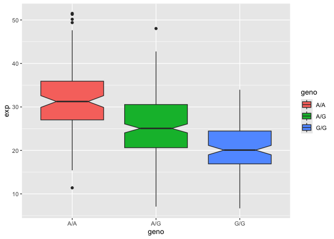

# Class 12: Lab Session
Michael McClellan (PID: A16962395)

- [Section 1. Proportion of G/G in a
  population](#section-1-proportion-of-gg-in-a-population)
  - [Section 4: Population Scale Analysis
    \[HOMEWORK\]](#section-4-population-scale-analysis-homework)

# Section 1. Proportion of G/G in a population

Download a CSV file from Ensemble \<
https://useast.ensembl.org/Homo_sapiens/Variation/Sample?db=core;r=17:39894595-39895595;v=rs8067378;vdb=variation;vf=959672880;sample=HG00109
\>

Here we read this CSV file:

``` r
mxl <- read.csv("373531-SampleGenotypes-Homo_sapiens_Variation_Sample_rs8067378.csv")
head(mxl)
```

      Sample..Male.Female.Unknown. Genotype..forward.strand. Population.s. Father
    1                  NA19648 (F)                       A|A ALL, AMR, MXL      -
    2                  NA19649 (M)                       G|G ALL, AMR, MXL      -
    3                  NA19651 (F)                       A|A ALL, AMR, MXL      -
    4                  NA19652 (M)                       G|G ALL, AMR, MXL      -
    5                  NA19654 (F)                       G|G ALL, AMR, MXL      -
    6                  NA19655 (M)                       A|G ALL, AMR, MXL      -
      Mother
    1      -
    2      -
    3      -
    4      -
    5      -
    6      -

``` r
table(mxl$Genotype..forward.strand.)
```


    A|A A|G G|A G|G 
     22  21  12   9 

``` r
table(mxl$Genotype..forward.strand.) / nrow(mxl) * 100
```


        A|A     A|G     G|A     G|G 
    34.3750 32.8125 18.7500 14.0625 

Now let’s look at a different population. I picked the GBR.

``` r
gbr <- read.csv("373522-SampleGenotypes-Homo_sapiens_Variation_Sample_rs8067378.csv")
head(gbr)
```

      Sample..Male.Female.Unknown. Genotype..forward.strand. Population.s. Father
    1                  HG00096 (M)                       A|A ALL, EUR, GBR      -
    2                  HG00097 (F)                       G|A ALL, EUR, GBR      -
    3                  HG00099 (F)                       G|G ALL, EUR, GBR      -
    4                  HG00100 (F)                       A|A ALL, EUR, GBR      -
    5                  HG00101 (M)                       A|A ALL, EUR, GBR      -
    6                  HG00102 (F)                       A|A ALL, EUR, GBR      -
      Mother
    1      -
    2      -
    3      -
    4      -
    5      -
    6      -

``` r
gbr
```

       Sample..Male.Female.Unknown. Genotype..forward.strand. Population.s. Father
    1                   HG00096 (M)                       A|A ALL, EUR, GBR      -
    2                   HG00097 (F)                       G|A ALL, EUR, GBR      -
    3                   HG00099 (F)                       G|G ALL, EUR, GBR      -
    4                   HG00100 (F)                       A|A ALL, EUR, GBR      -
    5                   HG00101 (M)                       A|A ALL, EUR, GBR      -
    6                   HG00102 (F)                       A|A ALL, EUR, GBR      -
    7                   HG00103 (M)                       A|G ALL, EUR, GBR      -
    8                   HG00105 (M)                       A|A ALL, EUR, GBR      -
    9                   HG00106 (F)                       G|A ALL, EUR, GBR      -
    10                  HG00107 (M)                       G|G ALL, EUR, GBR      -
    11                  HG00108 (M)                       A|A ALL, EUR, GBR      -
    12                  HG00109 (M)                       G|G ALL, EUR, GBR      -
    13                  HG00110 (F)                       A|G ALL, EUR, GBR      -
    14                  HG00111 (F)                       A|A ALL, EUR, GBR      -
    15                  HG00112 (M)                       G|G ALL, EUR, GBR      -
    16                  HG00113 (M)                       G|G ALL, EUR, GBR      -
    17                  HG00114 (M)                       G|A ALL, EUR, GBR      -
    18                  HG00115 (M)                       A|G ALL, EUR, GBR      -
    19                  HG00116 (M)                       G|G ALL, EUR, GBR      -
    20                  HG00117 (M)                       A|A ALL, EUR, GBR      -
    21                  HG00118 (F)                       G|G ALL, EUR, GBR      -
    22                  HG00119 (M)                       G|A ALL, EUR, GBR      -
    23                  HG00120 (F)                       G|G ALL, EUR, GBR      -
    24                  HG00121 (F)                       A|G ALL, EUR, GBR      -
    25                  HG00122 (F)                       G|G ALL, EUR, GBR      -
    26                  HG00123 (F)                       G|A ALL, EUR, GBR      -
    27                  HG00125 (F)                       A|G ALL, EUR, GBR      -
    28                  HG00126 (M)                       G|G ALL, EUR, GBR      -
    29                  HG00127 (F)                       G|A ALL, EUR, GBR      -
    30                  HG00128 (F)                       A|G ALL, EUR, GBR      -
    31                  HG00129 (M)                       G|G ALL, EUR, GBR      -
    32                  HG00130 (F)                       A|G ALL, EUR, GBR      -
    33                  HG00131 (M)                       G|G ALL, EUR, GBR      -
    34                  HG00132 (F)                       A|A ALL, EUR, GBR      -
    35                  HG00133 (F)                       G|A ALL, EUR, GBR      -
    36                  HG00136 (M)                       G|G ALL, EUR, GBR      -
    37                  HG00137 (F)                       G|A ALL, EUR, GBR      -
    38                  HG00138 (M)                       A|A ALL, EUR, GBR      -
    39                  HG00139 (M)                       G|G ALL, EUR, GBR      -
    40                  HG00140 (M)                       G|A ALL, EUR, GBR      -
    41                  HG00141 (M)                       G|G ALL, EUR, GBR      -
    42                  HG00142 (M)                       G|G ALL, EUR, GBR      -
    43                  HG00143 (M)                       G|A ALL, EUR, GBR      -
    44                  HG00145 (M)                       A|A ALL, EUR, GBR      -
    45                  HG00146 (F)                       A|A ALL, EUR, GBR      -
    46                  HG00148 (M)                       G|A ALL, EUR, GBR      -
    47                  HG00149 (M)                       G|A ALL, EUR, GBR      -
    48                  HG00150 (F)                       G|A ALL, EUR, GBR      -
    49                  HG00151 (M)                       G|A ALL, EUR, GBR      -
    50                  HG00154 (F)                       G|G ALL, EUR, GBR      -
    51                  HG00155 (M)                       A|G ALL, EUR, GBR      -
    52                  HG00157 (M)                       A|A ALL, EUR, GBR      -
    53                  HG00158 (F)                       A|A ALL, EUR, GBR      -
    54                  HG00159 (M)                       A|A ALL, EUR, GBR      -
    55                  HG00160 (M)                       A|A ALL, EUR, GBR      -
    56                  HG00231 (F)                       A|G ALL, EUR, GBR      -
    57                  HG00232 (F)                       G|G ALL, EUR, GBR      -
    58                  HG00233 (F)                       G|G ALL, EUR, GBR      -
    59                  HG00234 (M)                       G|G ALL, EUR, GBR      -
    60                  HG00235 (F)                       A|A ALL, EUR, GBR      -
    61                  HG00236 (F)                       A|A ALL, EUR, GBR      -
    62                  HG00237 (F)                       A|A ALL, EUR, GBR      -
    63                  HG00238 (F)                       G|G ALL, EUR, GBR      -
    64                  HG00239 (F)                       G|A ALL, EUR, GBR      -
    65                  HG00240 (F)                       G|A ALL, EUR, GBR      -
    66                  HG00242 (M)                       G|A ALL, EUR, GBR      -
    67                  HG00243 (M)                       A|G ALL, EUR, GBR      -
    68                  HG00244 (M)                       G|A ALL, EUR, GBR      -
    69                  HG00245 (F)                       A|G ALL, EUR, GBR      -
    70                  HG00246 (M)                       A|G ALL, EUR, GBR      -
    71                  HG00250 (F)                       G|G ALL, EUR, GBR      -
    72                  HG00251 (M)                       G|A ALL, EUR, GBR      -
    73                  HG00252 (M)                       G|A ALL, EUR, GBR      -
    74                  HG00253 (F)                       A|A ALL, EUR, GBR      -
    75                  HG00254 (F)                       A|G ALL, EUR, GBR      -
    76                  HG00255 (F)                       A|G ALL, EUR, GBR      -
    77                  HG00256 (M)                       A|G ALL, EUR, GBR      -
    78                  HG00257 (F)                       G|G ALL, EUR, GBR      -
    79                  HG00258 (F)                       A|A ALL, EUR, GBR      -
    80                  HG00259 (F)                       G|A ALL, EUR, GBR      -
    81                  HG00260 (M)                       G|G ALL, EUR, GBR      -
    82                  HG00261 (F)                       G|G ALL, EUR, GBR      -
    83                  HG00262 (F)                       A|A ALL, EUR, GBR      -
    84                  HG00263 (F)                       G|A ALL, EUR, GBR      -
    85                  HG00264 (M)                       A|G ALL, EUR, GBR      -
    86                  HG00265 (M)                       G|G ALL, EUR, GBR      -
    87                  HG01334 (M)                       A|G ALL, EUR, GBR      -
    88                  HG01789 (M)                       G|A ALL, EUR, GBR      -
    89                  HG01790 (F)                       G|A ALL, EUR, GBR      -
    90                  HG01791 (M)                       A|A ALL, EUR, GBR      -
    91                  HG02215 (F)                       G|G ALL, EUR, GBR      -
       Mother
    1       -
    2       -
    3       -
    4       -
    5       -
    6       -
    7       -
    8       -
    9       -
    10      -
    11      -
    12      -
    13      -
    14      -
    15      -
    16      -
    17      -
    18      -
    19      -
    20      -
    21      -
    22      -
    23      -
    24      -
    25      -
    26      -
    27      -
    28      -
    29      -
    30      -
    31      -
    32      -
    33      -
    34      -
    35      -
    36      -
    37      -
    38      -
    39      -
    40      -
    41      -
    42      -
    43      -
    44      -
    45      -
    46      -
    47      -
    48      -
    49      -
    50      -
    51      -
    52      -
    53      -
    54      -
    55      -
    56      -
    57      -
    58      -
    59      -
    60      -
    61      -
    62      -
    63      -
    64      -
    65      -
    66      -
    67      -
    68      -
    69      -
    70      -
    71      -
    72      -
    73      -
    74      -
    75      -
    76      -
    77      -
    78      -
    79      -
    80      -
    81      -
    82      -
    83      -
    84      -
    85      -
    86      -
    87      -
    88      -
    89      -
    90      -
    91      -

Find the proportion of G\|G:

``` r
table(gbr$Genotype..forward.strand.) / nrow(gbr) * 100
```


         A|A      A|G      G|A      G|G 
    25.27473 18.68132 26.37363 29.67033 

This variant that is associated with childhood asthma is more frequent
in the GBR population than the MXL population.

Let’s now dig into this further.

## Section 4: Population Scale Analysis \[HOMEWORK\]

One sample is obviously not enough to know what is happening in a
population. You are interested in assessing genetic differences on a
population scale. So, you processed about ~230 samples and did the
normalization on a genome level. Now, you want to find whether there is
any association of the 4 asthma-associated SNPs (rs8067378…) on ORMDL3
expression.

How many samples do we have?

> Q13. Read this file into R and determine the sample size for each
> genotype and their corresponding median expression levels for each of
> these genotypes.

First, we need to read the file in.

``` r
expr <- read.table("rs8067378_ENSG00000172057.6.txt")
head(expr)
```

       sample geno      exp
    1 HG00367  A/G 28.96038
    2 NA20768  A/G 20.24449
    3 HG00361  A/A 31.32628
    4 HG00135  A/A 34.11169
    5 NA18870  G/G 18.25141
    6 NA11993  A/A 32.89721

I want to see how many total samples there are in the dataset.

``` r
nrow(expr)
```

    [1] 462

Now I want to see how many of each genotype there are in the dataset.

``` r
table(expr$geno)
```


    A/A A/G G/G 
    108 233 121 

Now let’s see the corresponding median expression levels for each of
these genotypes.

``` r
medians <- tapply(expr$exp, expr$geno, median)
medians
```

         A/A      A/G      G/G 
    31.24847 25.06486 20.07363 

> Q14. Generate a boxplot with a box per genotype, what could you infer
> from the relative expression value between A/A and G/G displayed in
> this plot? Does the SNP affect the expression of ORMDL3?

I want to load ggplot so that I can make a boxplot.

``` r
library(ggplot2)
```

Let’s make a boxplot.

``` r
ggplot(expr) + aes(x=geno, y=exp, fill=geno) + 
  geom_boxplot(notch=TRUE)
```



From the boxplot, we can see that there is a difference between the
different genotypes and their respective expression levels. You can see
that the expression level of the ORMDL3 gene is lowest when there is a
G/G and highest when there is A/A, on average. Based on the boxplot, it
seems that the SNP does affect the expression of ORMDL3.
